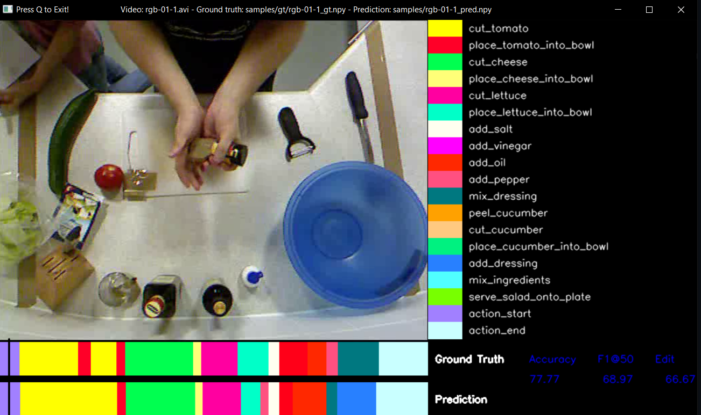

# Video Action Segmentation and Comparison

## If you find it useful [Buy me a coffee ](https://baolocpham.github.io/ThapSangAnhSuoiAmEm/) :blush:


## Overview

Comparing human activities is a core problem in areas such as sports sciences, rehabilitation and monitoring. Applications in these areas typically require the user to perform a set of pre-defined activities and evaluate the correctness/quality by comparing the performed activities with given exemplars. 

In this project, our goal is detect what activities the person is performing at each timestamp of video. Then, compare with the same sequence action video from our database. We use [AsFormer](https://github.com/ChinaYi/ASFormer), Transformer for Action Segmentation and post processing by [ASRF](https://github.com/ChinaYi/asrf_with_asformer) to detect human action from each segment of video. We also structured our repository for implementing other custom dataset, but make sure to follow the architecture below.

## Dataset

We use <a href="https://cvip.computing.dundee.ac.uk/datasets/foodpreparation/50salads/">50 salads</a> dataset for our end-to-end action and comparison task. It captures 25 people preparing 2 mixed salads each and contains over 4h of annotated accelerometer and RGB-D video data. Including detailed annotations, multiple sensor types, and two sequences per participant, the 50 Salads dataset may be used for research in areas such as activity recognition, activity spotting, sequence analysis, progress tracking, sensor fusion, transfer learning, and user-adaptation.

## Installation

Create virtual environment with conda
```
conda create -n nli python=3.8
conda activate nli
```
Install dependencies:
```
pip install -r requirements.txt
```

## Feature Extraction

First, we have to take the preprocess step by extracting each video frame to a vector with dimension (2048 x n), which n is a number of frame before input to Transformer model. For detail instruction, follow [Feature extraction](feature_extraction/README.md) to get the appropriate features for next step. Because all frames in video are processed, without GPU it might take a lot of times to finish :D


## Directory Explaination

```directory structure
root ── csv/
      ├─ libs/
      ├─ imgs/
      ├─ result/
      ├─ utils/
      ├─ dataset ─── dataset_name/─── features/
      │                        ├─ groundTruth/
      │                        ├─ splits/
      │                        └─ mapping.txt
      │  
      ├.gitignore
      ├ README.md
      ├ requirements.txt
      ├ save_pred.py
      ├ train.py
      └ evaluate.py
```

* `csv` directory contains csv files which are necessary for training and testing.
* Experimental results are stored in `results` directory.
* Scripts in `utils` are directly irrelevant with `train.py` and `evaluate.py` but necessary for converting labels, generating configurations, visualization and so on.
* Scripts in `libs` are necessary for training and evaluation. e.g.) models, loss functions, dataset class and so on.
* `train.py` is a script for training networks.
* `evaluate.py` is a script for evaluation.
* `save_pred.py` is for saving predictions from models.
* `inference.py` is for extracting and segmenting a new video.

## Flow

Please also check `scripts/experiment.sh`, which runs all the following experimental codes.

1. First, after feature extraction step, place all feature to features directory like above.

1. Features and groundTruth labels need to be converted to numpy array. [This repository](https://github.com/yabufarha/ms-tcn) does not provide boundary groundtruth labels, so you have to generate them, too.
Please run the following command. `[DATASET_DIR]` is the path to your dataset directory.

    ```bash
    python utils/generate_gt_array.py --dataset_dir [DATASET_DIR]
    python utils/generate_boundary_array.py --dataset_dir [DATASET_DIR]
    ```

1. In this implementation, csv files are used for keeping information  of training or test data. You can run the below command to generate csv files, but we suggest to use the csv files provided in the repo. 

    ```bash
    python utils/make_csv_files.py --dataset_dir [DATASET_DIR]
    ```

1. You can automatically generate experiment configuration files by running the following command. This command generates directories and configuration files in `root_dir`. However, we suggest to use the config files provided in the repo.

    ```bash
    python utils/make_config.py --root_dir ./result/50salads --dataset 50salads --split 1 2 3 4 5
    python utils/make_config.py --root_dir ./result/gtea --dataset gtea --split 1 2 3 4
    python utils/make_config.py --root_dir ./result/breakfast --dataset breakfast --split 1 2 3 4
    ```

    If you want to add other configurations, please add command-line options like:

    ```bash
    python utils/make_config.py --root_dir ./result/50salads --dataset 50salads --split 1 2 3 4 5 --learning_rate 0.1 0.01 0.001 0.0001
    ```

    Please see `libs/config.py` about configurations.

1. You can train and evaluate models specifying a configuration file generated in the above process like, we train 80 epochs for 50salads dataset in the config.yaml.

    ```bash
    python train.py ./config/config.yaml
    python evaluate.py ./config/config.yaml
    ```

1. You can also save model predictions as numpy array by running:

    ```bash
    python save_pred.py ./config/config.yaml
    ```
1. You can also visualize prediction and ground truth of the input videos
    
    ```bash
    python visualize.py --video_path <video path> --gt_file <ground truth path> --prediction_file <predicted npy path>
    ```

1. You can comparison the predicted video to your video database by accessing the path to list of video placed.

    ```bash
    python comparison/comparison.py --output_path <output> --database_path comparison/gt_file.txt
    ```
 ## Sample Visualization



## API
Run app Flask
```
python app.py
```
Because feature extraction step takes more time than our expectation, so the input file of our API is the extractive video npy file. Sorry for our inconvenience :sob:
## Docker

Build an Run

```
    docker build -t action:v1 .
    docker run -it -p 5000:5000 action:v1
```

## Citation

@inproceedings{chinayi_ASformer,  
	author={Fangqiu Yi and Hongyu Wen and Tingting Jiang}, 
	booktitle={The British Machine Vision Conference (BMVC)},   
	title={ASFormer: Transformer for Action Segmentation},
	year={2021},  
}
